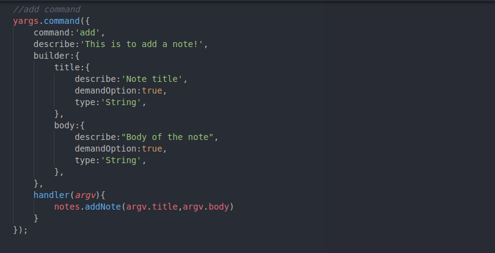
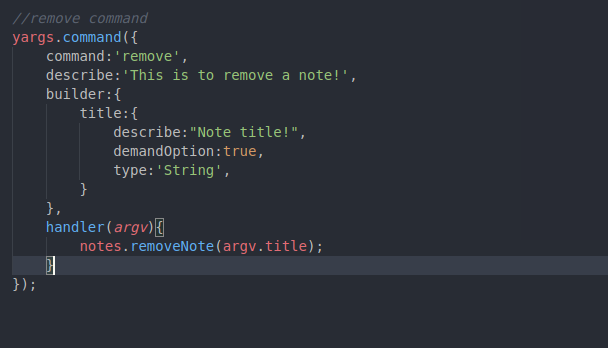

# notes-app

It has four commands namely; <b>add, remove, list and read</b>

On cloning this repo, run the command below: <code>npm install</code>

<h3>Add Command</h3>

The add command requires the command line arguments; title and body.

<h4>Example:</h4>

<code>node app.js add --title="some title" --body="some content"</code>

<h3>Remove Command</h3>

The remove command requires just one command line argument; title.

<h4>Example:</h4>

<code>node app.js remove --title="some title"</code>
\

<h3>List Command</h3>

The List command requires doesn't accept any command line argument

<h4>Example:</h4>

<code>node app.js list</code>

<h3>Read Command</h3>

The Read command requires the command line argument; title

<h4>Example:</h4>

<code>node app.js read --title="some title"</code>

All the operations are being carried out on the notes.json file located in the file.  Feel free to mess with the code and if you've got question(s), mail me with a <a href="mailto:astonishingdami9@gmail.com">click</a>

